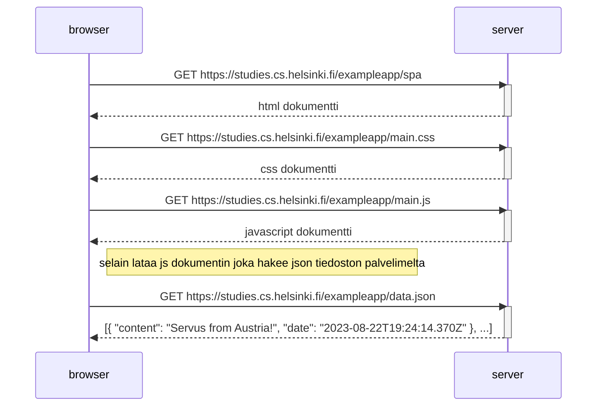

```mermaid

sequenceDiagram
    participant browser
    participant server


    browser->>server: GET https://studies.cs.helsinki.fi/exampleapp/spa
    activate server
    server-->>browser: html dokumentti
    deactivate server

    browser->>server: GET https://studies.cs.helsinki.fi/exampleapp/main.css
    activate server
    server-->>browser: css dokumentti
    deactivate server

    browser->>server: GET https://studies.cs.helsinki.fi/exampleapp/main.js
    activate server
    server-->>browser: javascript dokumentti
    deactivate server

    Note right of browser: selain lataa js dokumentin joka hakee json tiedoston palvelimelta

    browser->>server: GET https://studies.cs.helsinki.fi/exampleapp/data.json
    activate server
    server-->>browser: [{ "content": "Servus from Austria!", "date": "2023-08-22T19:24:14.370Z" }, ...]
    deactivate server
```
